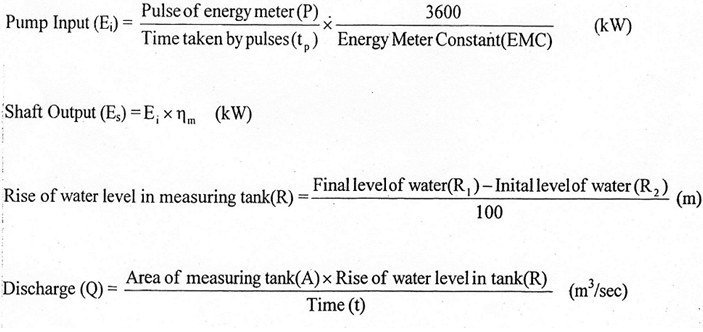

This folder has 

### Aim: 
To determine Pump Output, Overall efficiency, Pump efficiency of centrifugal pump. To plot the performance characteristic head v/s discharge and pump v/s discharge.

### THEORY

The hydraulic machines, which convert the mechanical energy into hydraulic energy, are called pumps. The hydraulic energy is in the form of pressure energy. If the mechanical energy is converted in to pressure energy bymeans of centrifugal force acting on the fluid, the hydraulic machine is called centrifugal pump.

The centrifugal pump acts as a reversed of n inward radial flow reaction turbine. This means that the flow in centrifugal pumps is in the radial outward directions. The centrifugal pumps works on the principal of forced vertex flow, which means that an external torque rotates a certain mass of liquid, the rise in pressure head of the rotating liquid, the rise in pressure head of the rotating liquid takes place. The rise in pressure head at any point of the rotating liquid is proportional to the square of tangential velocity of (i.e. rise in pressure head-V²/2g or 'r/2g) the liquid at

that point. Thus at the outlet of the impeller where radius is more, the rise in pressure head will be more and the liquid will be lifted to a high level.

Centrifugal pump is a mechanical device, which consists of a body, impeller and a rotating mean e. Motor, Engine etc. impeller rolates in a stationary body and sucks the fluid through its axes and delivers through its periphery. Impeller has an inlet angle, outlet angle and peripheral speed, which affect the head and discharge. Impeller is rotated by motor or i.c engine or any other device.

### EXPERIMENTAL SET UP
Centrifugal pumps Test Rig consists a sump, a centrifugal pump, a Dc motor and measuring tank. To measure the head, pressure and vacuum gauges are provided. To measure the discharge, a measure ring tank is provided, flow diversion system is provided to divert flow sump tank to measuring tank and from measuring tank to sump tank.

### PROCEDURE

1. Clean the apparatus and make all tanks fee from dust.
2. Close the drain valve Vs and Vo
3. Fill sump tank with clean water and ensure that no foreign particle are there.
4. Open flow control valve V, given on the water discharge line and control valve V₂ given on suction line.
5. Ensure that all ON/OFF switches given on the panel are at OFF position. Switch on the motor.
6. Operate the flow control valve V, to regulate the flow of water discharged by the pump. 7. Operate the control valve V₂ to regulate the suction of the pump.
8. Record discharge pressure by means of pressure gauges, provided on discharge line.
(Partially closed value V, in case of fluctuation.)
9. Record suction pressure by means of vacuum gauge, provided suction of pump (partially closed valve V, in case of fluctuation)
10. Record the time for 10-20 pluses by means of energy meter and stop watch.
11. Measure the discharge water by using measuring tank and stop watch. 12. Repeat the same procedure for different discharge with constant speed.

### RESULTS

The following results are, Power output (E).........kW, Pump efficiency......%and Overall efficiency..........%. To Plot the following H v/s Q and 77, v/s Q.

### PRECAUTIONS

1.	Never run the apparatus if power supply is less than 180 volts and above 230 volts.
2.	Conduct the experiment when water gets stable.
3.	Always use clean water.
4.	To prevent clogging of moving parts, run pump at least once in a fortnight.
5.	Drain the apparatus completely after experimentation.
6.	Always keep apparatus free from dust.
